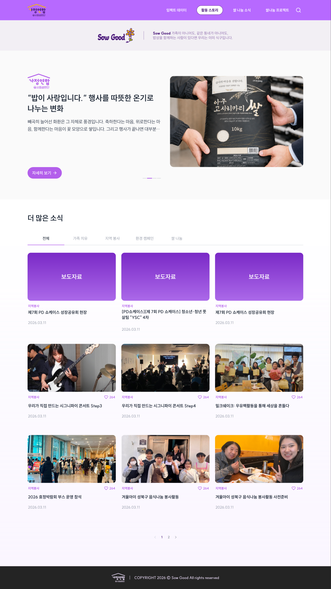
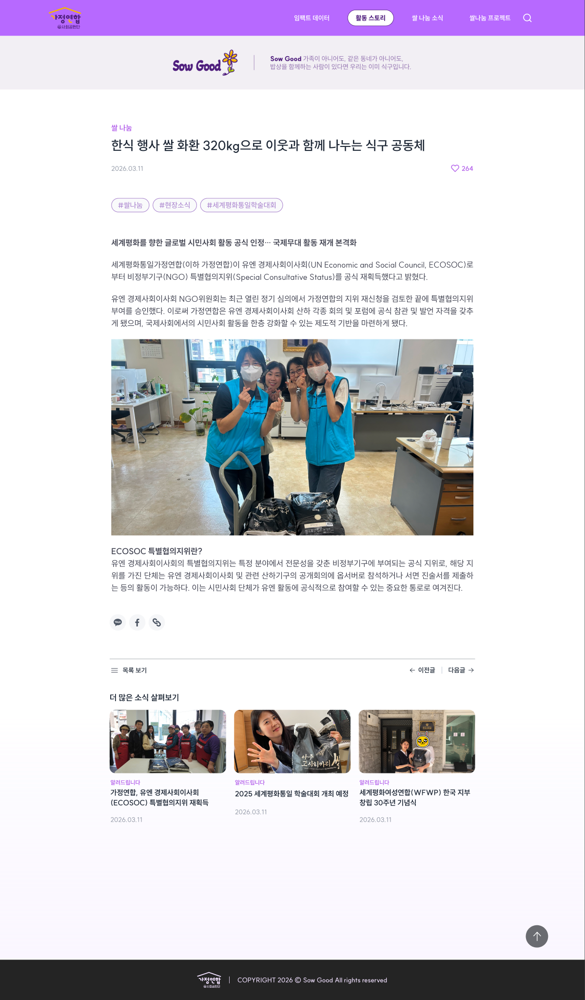
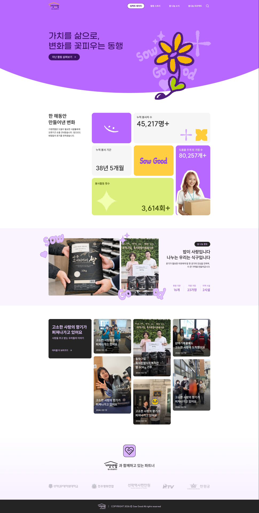
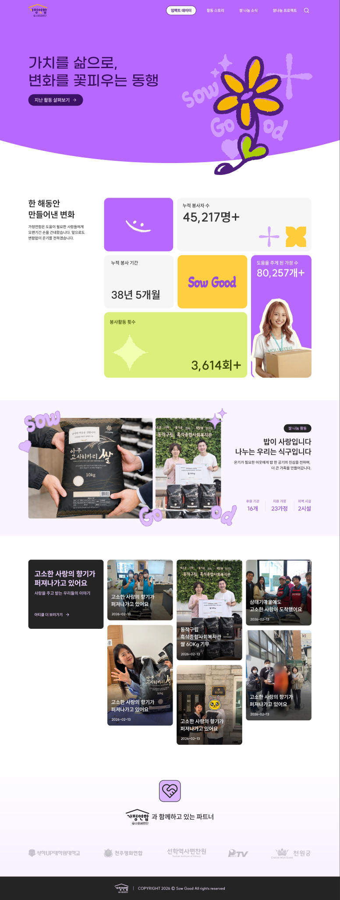
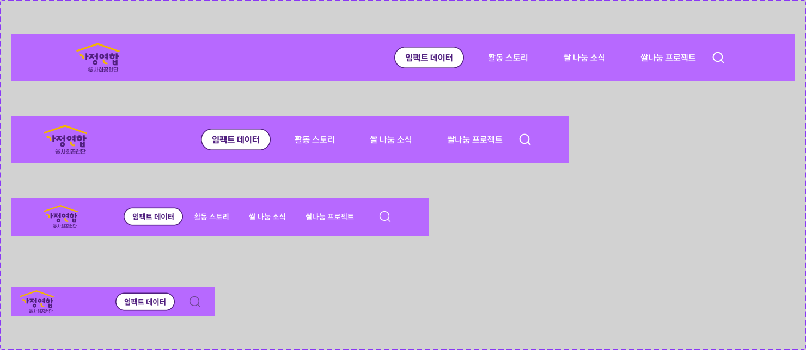
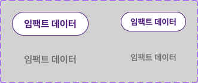
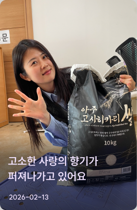
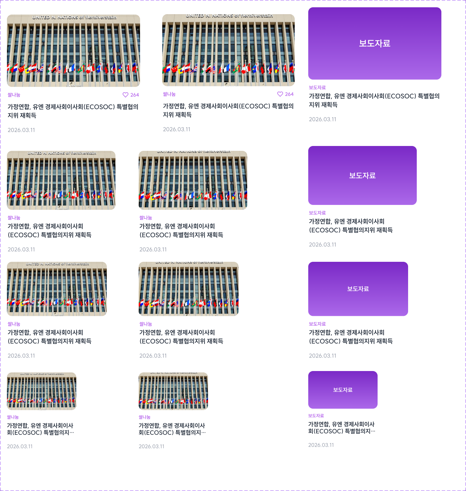
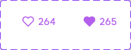

<!-- Figma 정리본. 사이트맵·디자인 토큰·컴포넌트 인덱스. Figma가 SSOT임을 잊지 말 것 -->

# Design — Figma 정리본

> Figma가 SSOT다. 이 문서는 *Figma의 인덱스이자 추출본*이다. Figma가 바뀌면 여기 변경 사항과 확인 날짜를 메모한다.

> ✅ **현재 추출 상태 (2026-05-30)**: 1440 폭 깊이 추출 + **1025~1439 / 768~1024 / 375~767 작은 사이즈 시안도 수령 완료**(스크린샷 기반 시각 메모). 각 BP 범위마다 디자이너가 *양 끝 두 폭*(예: 1025/1439)을 따로 그려준 의도는 BP 사이 보간 가이드.
>
> 🔄 **2026-05-30 동기화 — 디자인 변경 사항 반영**(사용자 노드 ID 3건 재공유 기반).
> - 홈 1920/1024 자식 frame ID 변경 (`126:11815`→`331:7984`, `126:10980`→`332:9254`). ~~1439 자식 frame 삭제 (1440에 통합).~~ **2026-06-04 라이브 메타데이터 정정: 1439 프레임 존재 (`332:8837`)** — 랜딩은 8 BP 프레임 전부 그려져 있음(export 8장과 일치). `docs/design/audit-report.md` 부록 B.
> - 소식 페이지 상단 **Banner 띠 정식 등장** (D-4 에 *사용자 지적으로 제거* 했던 위치) — 카피 "Sow Good 가족이 아니어도, 같은 동네가 아니어도, 밥상을 함께하는 사람이 있다면 우리는 이미 식구입니다." (사용자 결정 2026-05-30 "신 Figma 정식 도입").
> - 부모 노드 3종(`97:10250` / `96:5908` / `95:9359`) · 자산 매핑(KPI 사진·파트너 로고 등) ID **변동 없음**.
> - 사회공헌국 원본 사진 11장 + 파트너 BI 5장 *사용자 조달* 대기 (`docs/TODO.md` 신규 항목).

## Figma 정보

- **URL**: https://www.figma.com/design/lmjjU4UxUpK2pDi67BGRiW/%EC%82%AC%ED%9A%8C%EA%B3%B5%ED%97%8C%EA%B5%AD
- **파일명**: 사회공헌국
- **파일 ID**: `lmjjU4UxUpK2pDi67BGRiW`
- **공유받은 시작 노드**: `96-7689` (Dev Mode 진입점)
- **최근 확인 날짜**: 2026-06-03 (반응형 매트릭스 정정 + **KPI·Hero 2차 재정정** — 아래 §반응형 컴포지션 매트릭스 정정 노트) / 2026-05-30 / 2026-05-26
- **연결 방식**: Figma MCP (`plugin:figma:figma`)

## 캔버스 구조 (2026-05-26 확인)

Figma 파일은 단일 페이지("Page 1")이고, 그 안에 3개 섹션이 있다.

| 섹션 | 내용 |
|---|---|
| 컴포넌트 | 헤더 컴포넌트 (4 브레이크포인트 variants) |
| 홈-반응형 | 홈 페이지 4 브레이크포인트 × 2개 시안 |
| 소식 전체/상세 | 소식(=임팩트 스토리) 페이지 목록·상세 × 4 브레이크포인트 |

## 페이지 인덱스 — 1차 런칭 (ADR-006 + ADR-009 + ADR-022 정합)

> **Figma가 SSOT** (ADR-000). 의도서 §5의 7 페이지 IA는 **ADR-006으로 폐기**. Figma 4 헤더 메뉴 기준으로 재정렬. 메뉴 3개는 *랜딩 섹션 앵커*, 1개는 별도 페이지(소식).

| 헤더 메뉴 (ADR-009) | 라우트 / 앵커 | 디자인 상태 | Figma 노드 | 비고 |
|---|---|---|---|---|
| 메인 홈 (1920px) | `/` | ✅ 있음 | `331:7984` (1920×3803) | 큰 데스크톱 폭. 2026-05-30 자식 ID 변경 (구 `126:11815` 폐기) |
| 메인 홈 (1440px) | `/` | ✅ 있음 | `96:7689` (1440×3803) | 1440 폭 변형 |
| 임팩트 데이터 (메뉴 1) | `/#kpi` 앵커 | ✅ 랜딩 KpiSection | `96:7773` | 4 KPI 카드 |
| 활동 스토리 (메뉴 2) | `/#stories` 앵커 | ✅ 랜딩 ArticleGrid | `96:7895` | 마조네리 3열 |
| 쌀 나눔 소식 (메뉴 3) | `/news` (목록·상세) | ✅ 있음 (목록+상세 1440) | `125:8904` / `93:8810` | 별도 페이지 |
| 쌀나눔 프로젝트 (메뉴 4) | `/#story` 앵커 *추론* | ✅ 랜딩 StorySection *추정* | `96:7834` | 사회공헌국 확인 필요 |

### 폐기된 의도서 §5 페이지 (ADR-006으로 제거)

`/about` 소개 · `/reports` 투명성 리포트 · `/regions` 권역별 현황 · `/partners` 파트너 스토리 · `/join` 참여하기 — 모두 1차에서 사용 안 함. v1.1 이후 도입 검토.

## 소식 페이지 섹션 컨테이너 매핑

목록·상세 두 페이지 모두 1440 폭 시안 확인. 다른 폭은 추후.

### 소식_전체 (`125:8904`, 1440×2559)

| # | 섹션 | 노드 | 크기 | 내용 |
|---|---|---|---|---|
| 1 | Header (instance) | `135:11784` | 1440×88 | 공통 헤더 |
| 2 | Title | `125:8907` | 1440×216 | 페이지 도입 카피 ("쌀이 사랑입니다" / "행사를 따뜻한 온기로 / 나누는 변화") |
| 3 | Banner | `125:8915` | 1440×132 | 안내 배너 ("Sow Good 가족이 아니어도, 같은 동네가 아니어도, 밥상을 함께하는 사람이 있다면 우리는 이미 식구입니다.") — 2026-05-30 카피·정식화 갱신 |
| 4 | Contents (Featured) | `125:8985` | 1440×646 | 피처드 큰 카드 1개 — 큰 사진 + 카피 + "자세히 보기 +" |
| 5 | Wrap (Grid + Pagination) | `125:9124` | 1440×1594 | "더 많은 소식" + 카테고리 탭 + 카드 그리드 3×3 + 페이지네이션 |
| 6 | Line 87 | `125:9155` | 1314×0 | 구분선 |
| 7 | Footer | `125:9156` | 1440×99 | 공통 푸터 |

### 소식_상세 (`93:8810`, 1440×2459)

| # | 섹션 | 노드 | 크기 | 내용 |
|---|---|---|---|---|
| 1 | Header (instance) | `106:6633` | 1440×88 | 공통 헤더 |
| 2 | Contents.Background | `106:9231` | 1440×598 | 상단 배경 + Sow Good 일러스트 + 띠 카피 |
| 3 | Contents.Banner | `106:9112` | 1440×132 | 동일 안내 배너 (재사용) |
| 4 | Contents.Contents | `93:8813` | 1440×1859 | 게시글 본문 — 카테고리 칩 + 제목 + 메타(작성일+좋아요) + 태그 + rich text + 이미지 + 공유 아이콘 + "다른 소식 살펴보기" 관련 글 카드 3개 |
| 5 | Footer | `96:5453` | 1440×99 | 공통 푸터 |
| 6 | Wrap (Scroll-to-top) | `93:8871` | 116×116 | 우하단 떠다니는 위로 스크롤 버튼 |

### 새로 발견된 (미추출) 컴포넌트 후보

이번 시안에서 보이지만 아직 design_context로 받지 않은 컴포넌트들. 다음 추출 대상.

| 후보 | 위치 (페이지) | 메모 |
|---|---|---|
| **Banner** | 목록·상세 공통 | "Sow Good 가족이 아니어도, 같은 동네가 아니어도, 밥상을 함께하는 사람이 있다면 우리는 이미 식구입니다." 가로 안내 배너 (2026-05-30 카피 갱신). 재사용 강함 |
| **CategoryTabs** | 목록 (`125:9124` 안) | 전체 / 쌀 나눔 / 보도자료 / 쌀나눔 프로젝트 / (1개 더) 5개 탭 |
| **Pagination** | 목록 | Prev · 1 · 2 · 3 · Next 형식 |
| **FeaturedStoryCard** | 목록 상단 | 대형 단일 카드 — 카피 + 이미지 + CTA |
| **CategoryChip** | 상세 상단 | 보라 채움 칩 ("쌀 나눔") |
| **Tag** | 상세 본문 | `#이웃관심` 등 해시태그 |
| **SocialShare** | 상세 본문 | 공유 아이콘 묶음 |
| **RelatedStories** | 상세 하단 | "다른 소식 살펴보기" + ArticleCard size=4 추정 3개 |
| **ScrollTopButton** | 상세 우하단 | 떠다니는 위로 스크롤 |
| **Footer** | 공통 | 후원사·BI 로고들 + 카피라이트 |
| **PageTitle (대형 헤딩)** | 목록 상단 | 페이지 도입 카피 영역 |

## 메인 페이지 섹션 컨테이너 매핑

두 시안 모두 *동일한 6개 직속 자식 컨테이너* — 같은 페이지의 두 폭 디자인임을 구조로 확인.

| # | 섹션 (스크린샷 추정) | 1440 노드 | 1920 노드 | 높이 | 사용 컴포넌트 (추정) |
|---|---|---|---|---|---|
| 1 | **HeroBanner** | `96:7690` | `331:7985` | 740 | Header(=instance) + 슬로건 + Sow Good 해바라기 일러스트 |
| 2 | **KpiSection** | `96:7773` | `331:8061` | 952 | KPI 카드(45,217명+ 등 4개) + Sow Good 노란 카드 |
| 3 | **StorySection** | `96:7834` | `331:8123` | 573 | 인물·쌀 패키지 미니 그리드 + "쌀 사람들의 / 나누는…" 카피 |
| 4 | **ArticleGrid** | `96:7877` | `331:8155` | 982 | ArticleCard 그리드 (size 2/3 추정) — "고소 사랑의 향기가" 외 6개 |
| 5 | **Section5** | `96:7897` | `331:8174` | 457 | 후원·파트너 섹션 — PartnersSection |
| 6 | **Footer** | `126:10897` | `331:8245` | 99 | 후원사 로고 라인 + 카피라이트 |

> ✅ **2026-05-31 1920 자식 섹션 ID 재추출 완료** (`get_metadata({nodeId: "331:7984"})` 1회). 옛 1920 자식 ID(`126:11816/11892/11954/11986/12005/12076`) 는 신 메타에서 전부 사라짐 — *완전 폐기*. 1440 컬럼은 변동 없음이라 그대로 신뢰.

### 1024 BP 자식 섹션 ID (2026-05-31 추가, 부모 `332:9254`)

| # | 섹션 | 1024 노드 ID | 높이 | 비고 |
|---|---|---|---|---|
| 1 | HeroBanner | `332:9255` | 450 | 헤더 70px (1920 의 88 보다 축소) |
| 2 | KpiSection | `332:9331` | 840 | KPI 카드 비율 1024 폭에 맞춤 |
| 3 | StorySection | `332:9393` | 682 | |
| 4 | ArticleGrid | `332:9425` | 1079 | 마조네리 좌측 다크 헤더 위로 이동, 우측 3열 유지 |
| 5 | PartnersSection | `332:9444` | 547 | **6 슬롯 2×3 그리드** — 단 `image 38` 이 슬롯 #3·#5 *중복 표시* (디자이너 placeholder 채우기). **운영 5장 유지** |
| 6 | Footer | `332:9517` | 99 | |

> 추출 순서: HeroBanner → Footer(작음) → KpiSection → StorySection → ArticleGrid → Section5 (큰 섹션은 토큰 폭증 위험이라 작은 것부터 가서 페이스 조절)

## 랜딩 페이지 시각 비교 (1920 vs 1440)

| | 1920px (`331:7984`) | 1440px (`96:7689`) |
|---|---|---|
| 스크린샷 | `landing-331-7984-1920px.png` ✅ (2026-05-31 캡처 완료) | `landing-96-7689-1440px.png` |
| 전체 크기 | 1920×3803 | 1440×3803 |
| 컴포지션 | 동일 — 6개 섹션 같은 순서 | 동일 |
| 차이 | 카드 그리드가 더 넓게 펼침, 여백 큼 | 더 압축, 카드 간 여백 좁음 |
| 옛 ID(폐기) | `126:11815` — `screenshots/legacy/` 이동 완료 (2026-05-31) | — |

## 반응형 브레이크포인트 — 6+ 폭 디자인

각 BP 범위마다 *양 끝 폭*에 대한 디자인을 디자이너가 따로 그렸다. 사이는 보간.

### Tailwind 토큰 매핑 (코드 분기 기준) — 4-BP SSoT

> Figma 4 프레임 ↔ Tailwind 접두사. "와이드"는 Tailwind 기본 `xl:`(1280)이 **아니라** 커스텀 **`wide:`(1440)** — `src/app/globals.css @theme --breakpoint-wide: 1440px` 에 정의(토큰 SSoT).

| 구간 | 접두사 | 범위(px) | Figma 프레임 |
|---|---|---|---|
| 모바일 | (없음) | 0~767 | 375 |
| 태블릿 | `md:` | 768~1023 | 768 |
| 데스크탑 | `lg:` | 1024~1439 | 1025 |
| 와이드 | `wide:` | 1440~ | 1440 |

- **`lg`(1024)와 `wide`(1440)를 뭉개지 말 것.** 1440 값을 `lg:`에 넣으면 1024~1439가 과대/과소가 된다 (2026-06-05 PartnersSection 회귀: 파트너 로고를 1440 사이즈로 `lg`에 고정 → 1024~1439 과대. `wide:` 오버라이드로 수정).
- **4 프레임을 다 확인하고 *실제로 다른 지점*만 분기.** 같은 사이즈인 구간도 흔하다 — 예: Partners 헤딩(아이콘 58→92·로고 40→66·텍스트 20→28)은 **768/1024/1440 동일·375만 축소** / 파트너 로고는 **1440만 확대**(375~1439 동일). 매 BP마다 다른 값을 억지로 만들지 말 것.

> 🔴 **치명적 — `wide:` 는 base 만 override 하고 md/lg 는 못 이김** (Tailwind v4 ^4.0.0, 2026-06-05 확인).
> 격리 테스트(`px-[11] md:px-[22] lg:px-[33] wide:px-[55]`): 800→22(md✓) · 1200→**33(lg가 md 이김✓)** · 1920→**33(wide가 55 못냄 ✗)**. `.next` 클린 재빌드 후에도 동일 → stale 아님.
> 원인: 커스텀 `wide`(1440) media query 가 생성 CSS 에서 md/lg 보다 *앞에* 정렬됨. arbitrary `min-[1440px]:` 도 동일하게 깨짐.
> - ✅ **정상**: `wide:flex-row`(base `flex-col` override)·`wide:h-[var]`(base override) 등 *wide-over-base*.
> - ❌ **조용히 깨짐**: `lg:x wide:y`·`md:x wide:y` — wide 값 무시, md/lg 값 유지. (기존 `wide:` 31곳이 다 base-override 라 미노출이었음)
> - 회피: wide 전용 값은 (a) base 만 override 하게 구조 변경 또는 (b) `max-w` 등 breakpoint 비의존. **근본 수정(Tailwind 버전업 / breakpoint 재정의)은 별도 foundation 태스크 — 전 코드 `wide:` 재검증 필요.**

### 섹션 컨테이너 폭 (SectionContainer) — 콘텐츠 1200 고정

> Figma 전 섹션 Contents = **1200 고정·중앙**, gutter 만 축소(1920=360 · 1440=120 · 콘텐츠 불변). max-width 패턴 — "겉만 줄어든다". (1920 `331:7984` 5섹션 모두 Contents width=1200 검증, 2026-06-05)
> 구현: `mx-auto w-full max-w-[1320px] px-4 md:px-[60px]` (1320 = 콘텐츠 1200 + md gutter 120). 콘텐츠폭 base 343 / md 648 / lg 904 / (≥1320)1200. **base+md 만 써서 위 wide: 버그 무관.** Figma `max-width:1680` 는 프레임 속성일 뿐 실제 콘텐츠는 1200 (자식이 1200 고정).

### 랜딩 페이지 BP별 노드 (2026-05-30 자식 ID 갱신)

| 범위 | 분류 | 작은쪽 노드 | 큰쪽 노드 | 변동 |
|---|---|---|---|---|
| 1920~1440 | Large Desktop | `96:7689` (1440) | `331:7984` (1920) | **1920 ID 변경** (구 `126:11815`) |
| 1439~1025 | Desktop | `97:8573` (1025) | `332:8837` (1439) | **2026-06-04 정정: 1439 프레임 존재** (이전 "삭제" 기술 오류) |
| 1024~768  | Tablet | `97:9014` (768) | `332:9254` (1024) | **1024 ID 변경** (구 `126:10980`) |
| 767~375   | Mobile | `99:6950` (375) | `126:12232` (767) | 변동 없음 |

> 1920·1024 자식 frame ID 변동의 원인은 디자이너가 시안을 재정렬한 결과. 부모 `96:5908` (홈-반응형 섹션) 자체는 동일. 코드에는 영향 없음 (반응형은 폭 BP로 분기, 노드 ID 직접 참조 X).

### 소식 목록 BP별 노드

| 범위 | 노드 | 비고 |
|---|---|---|
| 1920~1440 | `125:8904` (1440) | 1920은 별도로 안 그림 — 1440이 큰쪽 |
| 1439~1025 | `125:9872` (1025) | |
| 1024~768  | `125:13072` (768) | |
| 767~375   | `135:11268` (375) + `135:12490` (767) | *양 끝 모두 그림* |

### 반응형 컴포지션 변화 매트릭스

각 BP에서 *섹션 컴포지션이 어떻게 바뀌는지* 핵심만.

| 섹션 | 1440·1920 | 1025·1439 | 768·1024 | 375·767 |
|---|---|---|---|---|
| **Header** | 4 메뉴 + active pill + 검색 | 4 메뉴 + active pill + 검색 | **4 메뉴 + active pill + 검색** (Header variant 768~1024 도 풀 노출 — 2026-06-03 정정, 이전 "햄버거+단일칩" 기술 오류) | **단일 활성 pill→드롭다운** + 검색 (375~767 only) |
| **HeroBanner** | 가로 2단 (슬로건 / 해바라기), 단색 보라 | 가로 2단 (좁아짐) | 가로, flower 우측 | flower 우측 absolute 겹침 (Method B), 단색 보라 |
| **KpiSection** | 데스크탑 벤토 | 데스크탑 벤토 | 벤토 (1024 데스크탑 / 768 2열 유동) | 유동 벤토 (640↑ 2열 / <640 1열 스택) |
| **StorySection** | 좌 이미지 / 우 텍스트+Result | 좌-우 유지 | 세로 스택 (이미지 위/텍스트 아래) | 세로 스택, **Result 통계 세로 배열** |
| **ArticleGrid** | 좌 다크 헤더 + 우 마조네리 3열 | 좌 다크 헤더 + 마조네리 3열 | 다크 헤더 위 + 마조네리 **2열** | 헤딩 위 + **1열 스택** (다크 블록 없어짐) |
| **Section5 Partners** | 5 로고 가로 (로고 크게 +헤딩 大) | 5 로고 가로 (로고 작게) | 3+2 그리드 (로고 작게) | 1열 스택 (헤딩 小·로고 작게) |
| **Footer** | 한 줄 | 한 줄 | 한 줄 | 한 줄 (압축) |

> ⚠️ **2026-06-03 매트릭스 정정 (Figma 직접 확인 + 구현 정합)** — 위 매트릭스는 스크린샷 추정이라 일부 셀이 Figma 와 어긋났음. 7면 병렬 디자인 검증(fan-out)에서 확인된 정정 (코드는 Figma 기준으로 구현):
> - **컴포지션 경계는 1024(`lg`) 단일.** Figma 1024 시안(`332:9254`)은 *데스크탑 컴포지션*(KPI 벤토·Story 좌우 2단·ArticleGrid 사이드 헤더·Partners 가로)에 속함. 진짜 태블릿 전용 밴드는 **768~1023 하나뿐**. "1024 = 세로/2x2" 표기는 오류.
> - **KpiSection (2026-06-03 2차 재정정 — Figma 노드 직접 크롭 확인)**: Figma 는 **375/768/1024/1440 전 BP 벤토**(보라 스마일·노란 Sow Good·도움가구 사진·별/그래프 데코). 앞선 "768=2x2 단순 그리드" 표기는 768 H-scroll 해소 중 **과잉 단순화 오류**였음(고정폭 데코가 범인이라 벤토 통째 제거했었음). 올바른 구현: **1024↑ 데스크탑 벤토(무수정 보존)** + **375~1023 별도 유동 벤토**(고정폭 w-293/size-83/h-423 → clamp·%·aspect, 640↑ 2열·<640 1열 스택, 데코는 640↑ 노출). 데스크탑과 동형 구조(상단 스마일+봉사자수, 하단 좌칼럼+사진 우측). ADR-035 supersede.
> - **StorySection**: Result 통계는 **375~1920 전 폭 가로 3열 + 세로 구분선**(Figma SSoT). "375~767 세로 배열"은 오류. 768~1023 = 이미지 위/텍스트 아래 세로 스택.
> - **ArticleGrid**: 좌측 다크 블록은 **전 폭 유지**(375 세로 스택 / 768~1023 가로 배너 heading↔CTA / 1024↑ 319px 사이드). "모바일 다크 블록 없어짐"은 오류.
> - **HeroBanner (2026-06-03 2차 재정정)**: 배경은 **전 BP 단색 보라(#b769ff)** — Figma 1440/768/375 모두 곡선·그라디언트 없음. 앞서 lg+ 에 깔던 lg:bg-gradient(surface-tint-soft→white) + 곡선 hero-banner-background.svg 는 시안에 없는 요소로, 상단에 흰 코너 노치를 만들어 어긋났기에 **제거**(헤더 bg-brand-bright 와 seamless). lg 미만 flower 는 우측 absolute Method B 유지(전 폭 가로 겹침). "세로 스택?"은 과잉 보수 오류. (hero-banner-background.svg 는 미참조 에셋이 됨)
> - **Partners**: 375~767 = **1열 세로 스택**, 768~1023 = 3+2(`md`), 1024↑ = 가로 1줄(`lg`).
> 구현·검증 상세: `docs/decisions.md` ADR-035, plan `docs/plans/active/2026-06-03-landing-data-responsive.md`.

### 소식 목록 페이지 매트릭스

| 섹션 | 1440 | 1025 | 768 | 375 / 767 |
|---|---|---|---|---|
| **Title 영역** | 좌 카피 + 우 일러스트 | 동일 | 압축 | 세로 스택 |
| **Banner** | 가로 띠 한 줄 | 가로 띠 | 압축 | 압축 (작은 폭) |
| **FeaturedCard** | 좌 텍스트 / 우 이미지 (캐러셀) | 동일 | 압축 | **세로 스택** (이미지 위 / 텍스트 아래) |
| **CategoryTabs** | 5 탭 가로 | 5 탭 가로 | 5 탭 가로 (압축) | **가로 스크롤** |
| **CardGrid** | 3 열 | 3 열 | **2 열** | **1 열** |
| **Pagination** | 가운데 정렬 | 동일 | 동일 | 동일 (가로) |

### 핵심 패턴 정리

1. **헤더 전환 (Figma Header 컴포넌트 4 variant SSoT, 2026-06-03 정정)**: **768 이상 = 풀 4 메뉴 + active 흰 pill**, **375~767 = 단일 활성 pill→드롭다운**. (이전 "1024 이하 햄버거/단일칩" 기술은 오류 — Header variant `768~1024` 도 4 메뉴 풀 노출. 코드 분기 `md`(768) 기준)
2. **그리드 열 수**: 마조네리 3 → 2 → 1, KPI 벤토 전 BP (1024↑ 데스크탑 / 640~1023 2열 / <640 1열 스택)
3. **2단 → 세로 스택**: StorySection·HeroBanner·FeaturedCard가 모바일에서 세로 스택
4. **결과 통계 (Result)**: 가로 라인 구분 → 세로 라인 구분
5. **ArticleGrid 좌측 다크 블록**: 데스크톱·태블릿에서는 사이드 헤더, 모바일에서는 *위에 단순 헤딩만*으로 변환
6. **카테고리 탭**: 모바일에서 가로 스크롤 (오버플로우)
7. **검색**: 모든 BP에서 표시 — 모바일에서도 햄버거 옆 검색 아이콘 유지

### BP 사이 보간 규칙

- *디자이너가 그린 두 폭 사이*는 fluid 스케일링이 아니라 *컴포지션 의도 유지*가 우선. 예: 1100px에서 1025보다 1439에 가까운 컴포지션 사용.
- 그리드 열 수 전환 BP는 *디자인된 두 폭 중 작은쪽에서 큰쪽으로 갈 때*를 기준. 예: 마조네리 2열 → 3열 전환은 **1025px**에서 발생.
- *깨지면 안 되는 요소*: 헤더 메뉴 칩(SUIT ExtraBold 14/16px), 카드 라운드, 보라/오렌지 컬러.

## BI — Sow Good

기획안과 별도로 진행된 사회공헌단 BI 작업 결과(`docs/source/meeting-2026-04-22-확장회의-사회공헌단BI.pdf`).

- **슬로건**: `Sow Good` (Sow 심다 + Good 선함 — "선함을 심다, 참사랑을 심다")
- **3대 가치**: 따뜻함 / 친근감 / 신뢰
- **컬러 의미**:
  - **보라색** = 친근감, 신뢰
  - **오랜지색** = 따뜻함
- **모티브**: 꽃 / 해바라기 (씨앗 → 꽃 피는 자연스러운 성장 이미지)
- **로고**: BI PPT의 디자인 A/B 검토 결과가 **현재 Figma 디자인에 그대로 반영**됨. Figma의 Sow Good 워드마크·해바라기·꽃 일러스트가 *최종 BI 자산* (확정 2026-05-26)

## 디자인 토큰

> Figma의 Variables/Styles에서 추출 후 채울 것. BI 가이드와 정합성 유지.

### 컬러 — Figma Variables (변수)

| 토큰 (Figma) | 값 | 의미 (BI 가이드) | 용도 |
|---|---|---|---|
| `KeyColor` | `#501F7E` | 보라색 = 친근감/신뢰 | Primary. 메뉴 선택 테두리·텍스트 |
| `KeyColor2` | `#F4B600` | 오렌지 = 따뜻함 | Accent. 포인트 |
| `Miscellaneous/Sidebar Fill - Selected` | `#FFFFFF` | 보조 | 선택 상태 배경 |

### 컬러 — 컴포넌트 추출 인라인 값 (변수화 안 됨, 2026-05-26 종합)

> ⚠️ 다음 색은 Figma Variables가 아닌 컴포넌트 내 인라인 값. 향후 변수로 승격 권장.

**Primary/Purple 계열 (실제 구현 토큰 — Tailwind v4 `@theme inline` D-4 매핑)**

> Sprint 1 D-4 (2026-05-27) 구현: shadcn `--primary` namespace 와 충돌 회피 + 의미 기반 분리를 위해 `--color-brand-*` namespace 채택. 텍스트는 `--color-ink-*`, 배경은 `--color-surface-*` 로 별도 prefix (관련 결정 — D-4 context-notes).
> Tailwind utility 명명: `bg-brand-primary`·`text-brand-vivid`·`bg-kpi-yellow`·`text-ink-strong` 등.

| 인라인 값 | 사용처 | 실제 토큰 (코드 SSoT) |
|---|---|---|
| `#3A0F62` | 히어로 슬로건 텍스트 (진보라) | `--color-brand-deep` |
| `#3C1264` | 히어로 CTA 버튼 배경 | `--color-brand-darkest` |
| `#501F7E` (=KeyColor) | 메뉴 선택 테두리·텍스트, Banner "Sow Good", Pagination active | `--color-brand-primary` (= `--primary`) |
| `#9257CA` | StorySection Result 카운트 | `--color-brand-mid` |
| `#9B7DB6` | Banner 본문 (연보라) | `--color-brand-soft` |
| `#B35FEB` | 카테고리 active 라인·좋아요·소식 CTA·캐러셀 active 인디케이터 | `--color-brand-vivid` |
| `#B769FF` | Header 배경, KpiCard 보라 | `--color-brand-bright` |
| `#DBB4FF` | Section5 아이콘 배경 | `--color-brand-pale` |
| `#F1E3FF` | StoryCard 텍스트 (라벤더) | `--color-brand-lavender` |
| `#F8F1FF` / `#FAF4FF` / `#F2EFF4` | 옅은 배경 그라디언트 시작 | (D-3 도입 예정 — `--color-surface-purple-tint-*`) |

**Lavender Text (보라 위 텍스트용 — 색깔별로 미묘하게 다름)**
| 값 | 사용처 |
|---|---|
| `#E4BDFF` | StorySection 태그 텍스트 |
| `#E9CFFF` | ArticleGrid 다크 블록 헤딩 |
| `#E9D1FF` | 히어로 CTA 텍스트 |
| `#F0E1FF` | Footer 카피라이트 |
| `#F1E3FF` | StoryCard 텍스트 |

**Accent / Special (D-4 매핑)**
| 값 | 사용처 | 실제 토큰 |
|---|---|---|
| `#F4B600` (=KeyColor2) | Accent | `--color-warm` |
| `#FFCF41` | KpiSection Sow Good 노란 카드 | `--color-kpi-yellow` |
| `#DCEF7D` | KpiSection 봉사활동 횟수 카드 (연두) | `--color-kpi-lime` |
| `#B769FF` | KpiSection 보라 카드 | `--color-kpi-purple` (= brand-bright alias) |
| `#F6F6F6` | KpiSection 그레이 카드 | `--color-kpi-gray` (= surface-soft alias) |
| `#3B4700` | DCEF7D 위 텍스트 (진녹) | (인라인, 토큰 미도입 — D-3 시점에 변환) |

**Dark / Text / Surface (D-4 매핑)**
| 값 | 사용처 | 실제 토큰 |
|---|---|---|
| `#242424` | Footer 배경, ArticleGrid 좌측 블록, 태그 알약 | `--color-surface-dark` |
| `#343434` | KpiCard 텍스트 | (인라인 — D-3 시점 토큰화) |
| `#3E404E` | **본문 텍스트 (Figma `text/text`)** ← 소식 상세 본문 | `--foreground` (= `--color-foreground`) |
| `#1F2937` | ArticleCard 제목, CategoryTabs active 텍스트 | `--color-ink-strong` |
| `#374151` | FeaturedStoryCard 본문 | (D-3 토큰화 — `--color-ink-strong` 흡수 검토) |
| `#6B7280` | 페이지네이션 inactive, 비활성 텍스트 | `--color-ink-subtle` (= shadcn `--muted-foreground`) |
| `#959BA9` | 날짜 텍스트 | `--color-ink-date` |
| `#F6F6F6` | KpiCard 그레이 배경 | `--color-surface-soft` (= `--color-kpi-gray`) |
| `#FAFAFA` | FeaturedStoryCard 배경 | `--color-surface-card` |
| `#F9FAFB` | Tag Default 배경 | (D-3 토큰화 — `surface-card` 흡수 검토) |
| `#F5F6F8` | SNS 아이콘 배경 | `--color-surface-cool` |
| `#D1D5DB` | CategoryTab 하단 라인 | (shadcn `--border` oklch(0.922 0 0) 근사) |

**Tag(해시태그) 색 (D-4 매핑)** — 보라 인접
| 값 | 사용처 | 실제 토큰 |
|---|---|---|
| `#AC86D0` | Tag Default 보더·텍스트 | `--color-tag-default` |
| `#9E6FCB` | Tag Hover 보더·텍스트 | `--color-tag-hover` |
| `#F7EFFF` | Tag Hover 배경 | `--color-tag-bg` |

**기타 (D-4 매핑)**
| 값 | 사용처 | 실제 토큰 |
|---|---|---|
| `#7B2AC7 → #AC69EA` | ArticleCard None 그라디언트, FeaturedStoryCard placeholder | `--color-gradient-from` / `--color-gradient-to` |
| `rgba(36,36,36,0.6)` | 비선택 텍스트 (D-3 헤더 시안 정합 시 `text-foreground/60` 으로) | (D-3 토큰화 검토) |
| `rgba(75,85,99,0.15)` | 캐러셀 inactive 인디케이터 | (P1 — `--color-carousel-inactive` 토큰화 권고) |

### 타이포그래피

**SUIT** (Heavy / ExtraBold / Bold / SemiBold / Medium / Regular — 6가지 weight 확인)

| Weight | 용도 (관찰) |
|---|---|
| Heavy | Banner "Sow Good" 워드마크 |
| ExtraBold | Menu 선택, ArticleGrid 좌측 헤딩 (31px) |
| Bold | 본문 헤딩, KPI 숫자, 메뉴 비선택, 카드 제목 |
| SemiBold | KpiCard 라벨, 섹션 헤딩, Footer 카피라이트, FeaturedStoryCard CTA |
| Medium | 본문, 날짜, 설명 |
| Regular | 긴 본문 (FeaturedStoryCard 본문) |

**Gmarket Sans Medium** — 히어로 슬로건 전용 (60px)

~~Pretendard Medium / Regular~~ — 페이지네이션에 사용됐으나 **디자인 실수로 결론(2026-05-26, ADR-008)**. **코드에서는 페이지네이션도 SUIT로 통일.**

**관찰된 사이즈 (px)**: 13 / 14 / 15 / 16 / 18 / 20 / 22 / 24 / 26 / 28 / 31 / 32 / 34 / 36 / 42 / 45 / 52 / 60

### 라운드(Border Radius)

| 값 | 사용처 |
|---|---|
| `999px` | Menu (완전 알약) |
| `14px` | ArticleCard 이미지 컨테이너 |
| `12px` | StoryCard 전체 |
| `9.333px` / `6.667px` | IconSet 내부

### 타이포그래피

| 토큰 | 스펙 | 용도 | 비고 |
|---|---|---|---|
| `--font-display` | TBD | 큰 헤딩, 슬로건 | |
| `--font-heading` | TBD | 섹션 헤딩 | |
| `--font-body` | TBD, **16px 이상** | 본문 | 고령 사용자 대응 (의도서 §7.5) |
| `--line-height-body` | 충분히 넓게 | | |

### 스페이싱

| 토큰 | 값 | 용도 |
|---|---|---|
| _(여백 토큰)_ | | 의도서: "넓은 여백" 강조 |

### 기타

| 토큰 | 값 | 용도 |
|---|---|---|
| 라운드 | TBD | 따뜻함 표현 — 둥근 모서리 권장 |
| 섀도우 | TBD | 절제. 과도한 입체감 지양 |

## 재사용 컴포넌트 인벤토리

> 2026-05-26 Figma MCP로 5개 컴포넌트 추출 완료. 스크린샷은 `docs/design/screenshots/`에 PNG로 저장.

### 1. Header (`97:9431`)

- **Variants**: 4개 — `1920~1440px` / `1025~1439px` / `768~1024px` / `375~767px`
- **구성**: 로고(가정연합 사회공헌단) + 메뉴 4개 + 검색 버튼
- **메뉴 항목** (현재 Figma 기준 4개): `임팩트 데이터` / `활동 스토리` / `쌀 나눔 소식` / `쌀나눔 프로젝트`
- **스타일**: 배경 `#B769FF` (밝은 보라). 선택된 메뉴는 흰 배경 + 보라 테두리 + 보라 ExtraBold.
- **모바일(375~767)**: 로고 + 선택 메뉴 1개만 표시 + 검색 (다른 메뉴는 드로어/햄버거 예상 — *현재 시안에 없음, 확인 필요*)

### 2. Menu (`9:3300`)

- **Variants**: 4개 — `size` (L/M) × `property1` (선택/비선택)
- L: padding 20/10, 텍스트 16px
- M: padding 16/8, 텍스트 14px
- **선택 상태**: `bg-white`, `border-[1.6px] border-[#501F7E]`, `rounded-full`, `SUIT ExtraBold #501F7E`
- **비선택 상태**: 투명 배경, `SUIT Bold rgba(36,36,36,0.6)`
- **표시 텍스트(샘플)**: "임팩트 데이터"

### 3. StoryCard (`44:1840`)

- **Variants**: 단일
- **크기**: `277.667 × 425`
- **구성**: 배경 이미지(인물 사진) + 하단 그라디언트 오버레이 + 카피 + 날짜
- **샘플 카피**: "고소한 사랑의 향기가 / 퍼져나가고 있어요"
- **샘플 날짜**: `2026-02-13`
- **텍스트 컬러**: `#F1E3FF` (옅은 라벤더)
- **라운드**: `12px`
- **용도**: 활동 스토리/임팩트 스토리 메인 카드. 인물 중심.

### 4. ArticleCard (`114:8164`)

- **Variants**: 12개 — `size` (1/2/3/4) × `property1` (Default/Hover/None)
- **사이즈별 크기**:
  - size=1: ~382~384 × 348 (대형, 좋아요 포함)
  - size=2: 313 × 310
  - size=3: 288 × 296
  - size=4: 200 × 237 (소형)
- **상태**:
  - `Default`: 이미지 + 카테고리 + 제목 + 날짜
  - `Hover`: Default 동일 + size=1일 때 좋아요 버튼 표시
  - `None`: 이미지 없는 *플레이스홀더* — 보라 그라디언트 배경 + "보도자료" 텍스트 over
- **카테고리 태그**: `쌀나눔` 또는 `보도자료` (보라 `#B35FEB`)
- **샘플 제목**: "가정연합, 유엔 경제사회이사회(ECOSOC) 특별협의지위 재획득"
- **샘플 날짜**: `2026.03.11`
- **라운드**: 이미지 컨테이너 `14px`

### 5. Heart (`114:8303`)

- **Variants**: 2개 — `Default` / `Click`
- **구성**: 하트 아이콘 + 카운트 숫자
- **상태**:
  - Default: 빈 하트 + `264`
  - Click: 채운 하트 + `265`
- **텍스트 컬러**: `#B35FEB`
- **포함처**: ArticleCard size=1 (Default/Hover 상태)

### 인터랙션 패턴 정리

- Menu: hover/active 상태 명시 안 됨. 선택은 *현재 페이지 표시*용.
- ArticleCard: hover 시 좋아요 표시. *클릭 시 상세 페이지 이동* 가정.
- Heart: 클릭 시 +1 카운트. *익명 좋아요(로그인 없음)* 가정 — 백엔드 모델 확인 필요.

### 누락·미확인

- **검색 결과**: 검색 아이콘은 있으나 검색 UI 별도 시안 없음
- **모바일 햄버거 드로어**: 헤더 모바일(375~767)에 메뉴 1개만 노출 — 나머지 메뉴 어떻게 접근하는지 미확인
- **폼**: 의도서가 정의한 파트너십·참여 폼 — *Figma에 없음*. 사이트에 폼이 있어야 하는지 확인 필요

---

## 랜딩 페이지 섹션 상세 명세 (2026-05-26 추출, 1440 폭 기준)

### 1) HeroBanner (`96:7690`, 1440×740)

- **슬로건**: "가치를 삶으로, / 변화를 꽃피우는 동행" — **Gmarket Sans Medium 60px**, `#3A0F62`
- **CTA 버튼**: "지난 활동 살펴보기" → 배경 `#3C1264`, 텍스트 `#E9D1FF`, SUIT Bold 20px, 알약, 우측 화살표
- **우측 일러스트**: 해바라기(`imgFlower`) 560×511
- **상단 풀스크린 배경 이미지** (`imgBannerBackground`, 1441×2875) — 깔리는 그래픽
- **Header (instance `98:7101`)**: 보라 `#B769FF` 88px 높이, 패딩 좌우 120px
- ⚡ **인터랙션 어노테이션**: `data-interaction-annotations="스크롤 위치에 따라 탭이 이동하는 인터렉션"` — 사용자가 처음에 언급한 "일부 인터랙션"이 이것

### 2) KpiSection (`96:7773`, 1440×952) — "한 해동안 만들어낸 변화"

- **좌측**: 헤딩 "한 해동안 / 만들어낸 변화" (SUIT Bold 36px, `#242424`) + 설명 (SUIT Medium 16px)
- **우측 Dashboard**: 다양한 색상의 KpiCard 그리드 (라운드 20px, 760px 높이)
- **KPI 4개 (Figma 기준 — ADR-006에 따라 의도서 KPI 5개 폐기)**:

| 지표 | 값 (현재 샘플) | 카드 색 | 텍스트 색 | 크기 |
|---|---|---|---|---|
| 누적 봉사자 수 | `45,217명+` | `#F6F6F6` 그레이 | `#343434` | 52px |
| 누적 봉사 기간 | `38년 5개월` | `#F6F6F6` 그레이 | `#343434` | 45px |
| 봉사활동 횟수 | `3,614회+` | `#DCEF7D` 연두 | `#3B4700` 진녹 | 52px |
| 도움을 주게 된 가정 수 | `80,257개+` | `#B769FF` 보라 | 흰 | 42px |

추가로 보라 캐릭터(웃는 얼굴) 카드 + 노란 Sow Good 카드(`#FFCF41`) 장식.

### 3) StorySection (`96:7834`, 1440×573) — "밥이 사랑입니다"

- **배경**: `#FAF4FF` (옅은 라벤더)
- **좌측**: 이미지 카드 2개 (큰 + 작은, 라운드 8px)
- **우측**: 
  - 태그 알약 "쌀 나눔 활동" — `#242424` 배경, `#E4BDFF` 텍스트, SUIT SemiBold 16px
  - 헤딩 "밥이 사랑입니다 / 나누는 우리는 식구입니다" — SUIT Bold 32px, `#242424`, *우측 정렬*
  - 설명 "온기가 필요한 이웃에게 밥 한 공기의 진심을 전하며…" — SUIT Medium 16px
  - **Result 통계 3개** — SUIT Bold 24px / SUIT Medium 15px 라벨, 컬러 `#9257CA`
    - 후원 기관 16개
    - 지원 가정 23가정
    - 지역 시설 2시설
- **장식**: heart, star, vector 일러스트 다수 (꾸미는 요소)

### 4) ArticleGrid (`96:7877`, 1440×982) — "고소한 사랑의 향기가…"

- **좌측 다크 블록** (319px, `#242424` 배경, 라운드 12px):
  - 헤딩 SUIT ExtraBold 31px, `#E9CFFF`: "고소한 사랑의 향기가 퍼져나가고 있어요"
  - 서브 SUIT SemiBold 18px: "사랑을 주고 받는 우리들의 이야기"
  - 버튼 "아티클 더 보러가기" + 화살표 (텍스트만, 배경 없음)
- **우측 마조네리 3열 그리드** — StoryCard(`44:1840`) 인스턴스 6개:
  - 다양한 높이: 256 / 425 / 425 / 337 / 278 / 381 — *마조네리(Masonry) 레이아웃*
  - 콘텐츠 다양: "고소한 사랑의 향기가...", "동작구립 흑석종합사회복지관 쌀 60Kg 기부", "삼태기마을에도..." 등
- → 메인의 활동 스토리 미리보기 섹션

### 5) Section5 — Partners (`96:7897`, 1440×457) — "함께하고 있는 파트너"

- **배경**: 그라디언트 `from-#F8F1FF to-#FFFFFF`
- **상단 (Wrap)**: 보라 아이콘 92×92 (`#DBB4FF` 배경, `#242424` 보더 2px, 라운드 20px) + Sow Good 로고 + "과 함께하고 있는 파트너" SUIT SemiBold 28px
- **하단 (List)**: 파트너 로고 5개 일렬, `opacity-23%` (이미지 42/37/38/39/41)
- ⚡ **의도서의 "파트너 스토리" 페이지가 이 섹션으로 통합됨** — 별도 페이지 아님

### 6) Footer (`126:10897`, 1440×99) — 공통 푸터

- 배경 `#242424` (다크), 가운데 정렬 1200px 너비
- BI 로고 59×39 + 세로 라인 + "COPYRIGHT 2026 © Sow Good All rights reserved" SUIT SemiBold 16px `#F0E1FF`

---

## 소식 페이지 공통 요소 상세 명세

### Banner (`125:8915`, 1440×132) — 공통 안내 띠

- 배경 `#F2EFF4` (옅은 라벤더), 가운데 정렬
- 구성: 좌측 Sow Good 워드마크/해바라기 SVG + 세로 라인 + 카피
- **카피**:
  > **Sow Good** 가족이 아니어도, 같은 동네가 아니어도,
  > 밥상을 함께하는 사람이 있다면 우리는 이미 식구입니다.
- "Sow Good" = SUIT Heavy `#501F7E`, 본문 = SUIT Medium 16px `#9B7DB6`
- 재사용처: 소식_전체 + 소식_상세

### FeaturedStoryCard Carousel (`125:8985`, 1440×646) — 소식 목록 상단 피처드

- **단일 카드가 아니라 4슬라이드 캐러셀!** 캐러셀 인디케이터 4개 확인.
- 배경 `#FAFAFA`, 1280px 너비
- **좌측 텍스트 영역**: 
  - 작은 SVG 로고 98×65
  - 헤딩 SUIT Bold 34px, `#1F2937`: "밥이 사랑입니다." 행사를 따뜻한 온기로 나누는 변화
  - 본문 SUIT Regular 20px, `#374151`: "빼곡히 늘어선 화환은 그 자체로 풍경입니다…"
  - CTA "자세히 보기" → `#B35FEB` 알약, 흰 SUIT SemiBold 18px, 화살표
  - **CarouselIndicator** — 4개 점, active = `#B35FEB` 너비 22px, inactive = `rgba(75,85,99,0.15)` 너비 17px, 높이 3px
- **우측 이미지** — 612×411 (16/9 비율, 라운드 16px)

### ScrollTopButton (`93:8871`, 116×116) — 상세 우하단 떠다님

- 원형(Ellipse 443) 55×55 + 위 화살표 36×36
- 스크롤 후 노출 추정

---

## 신규 컴포넌트 카탈로그 (랜딩 추출에서 발견)

### KpiCard (variants)
KpiSection에서 발견. 별도 컴포넌트 분리 권장.

| Variant | 배경 | 텍스트 색 | 사용 예 |
|---|---|---|---|
| Gray (기본) | `#F6F6F6` | `#343434` | 누적 봉사자 수, 봉사 기간 |
| Green | `#DCEF7D` | `#3B4700` | 봉사활동 횟수 |
| Purple Bold | `#B769FF` | `#FFFFFF` | 도움을 주게 된 가정 수 |
| Yellow Sow Good | `#FFCF41` | — | BI 강조 (장식) |

### CarouselIndicator
- Active: `#B35FEB`, width 22px, height 3px
- Inactive: `rgba(75,85,99,0.15)`, width 17px, height 3px
- 점 간격 2px

### PrimaryButton (variants)
- **Dark Purple (히어로)**: 배경 `#3C1264`, 텍스트 `#E9D1FF`, SUIT Bold 20px, 패딩 12/26
- **Bright Purple (소식 피처드)**: 배경 `#B35FEB`, 텍스트 흰, SUIT SemiBold 18px, 패딩 14/20
- 공통: 알약(`rounded-[999px]`), 우측 화살표 아이콘 20×20

### TagChip (다크)
- 배경 `#242424` 알약
- 텍스트 `#E4BDFF` (StorySection) 또는 `#E9CFFF` (ArticleGrid 좌측)
- SUIT SemiBold 16px

### SectionHeading
- StorySection·KpiSection·Section5 등 섹션 도입 헤딩 패턴
- SUIT Bold 28~36px, `#242424` 또는 진보라 계열
- 옆에 또는 위에 작은 로고/아이콘 동반

### ResultStatGroup
StorySection 우측 결과 통계 — 라벨 + 숫자 짧은 묶음 3개를 세로 라인으로 구분.

---

## 소식 목록 Wrap 상세 명세 (`125:9124`, 1440×1594)

"더 많은 소식" 섹션 전체. 카테고리 탭 + 9개 카드 그리드 + 페이지네이션.

### 구조

1. **상단 헤딩** (`125:9125`): "더 많은 소식" — SUIT Bold 32px, `#1F2937`
2. **CategoryTabs** (`125:9131`): 5개 탭, 하단 회색 라인(`#D1D5DB`)
3. **카드 그리드** (`125:9141/42/43`): `flex-wrap`, gap 48/24, 1200px, 3열 자동 줄바꿈, 9개 카드
4. **Pagination** (`125:9153/54`): 좌(Disable) · 1(active) · 2(default) · 우(Default)

### CategoryTabs 5개 — 카테고리 분류 확정

> ⚡ **의도서 §5.2의 3 카테고리(가족치유/지역봉사/환경캠페인)가 살아있음**. ADR-006으로 의도서 IA 폐기했어도 *카테고리 분류 체계는 유산이 살아있다*.

| 순 | 탭 라벨 | 상태 (Default 시안) | 폭 |
|---|---|---|---|
| 1 | **전체** | Active — SUIT Medium 17px `#1F2937`, 하단 `#B35FEB` 2px 라인 | 160 |
| 2 | **가족 치유** | Inactive — SUIT Regular 17px `#959BA9` | 140 |
| 3 | **지역 봉사** | Inactive | 140 |
| 4 | **환경 캠페인** | Inactive | 140 |
| 5 | **쌀 나눔** | Inactive | 140 |

→ 카드 안 카테고리 태그(`#B35FEB` 텍스트)도 위 5개 enum 중 하나. 시안에서 본 "지역봉사"·"보도자료"·"쌀나눔" 라벨은 *카드 상태별 다른 콘텐츠* 또는 *카테고리 enum 값*.
→ ArticleCard None 상태의 "보도자료" 라벨은 그라디언트 placeholder 표시 — 별도 카테고리가 아닌 *이미지 없음* 시각 표시.

### Pagination 컴포넌트 (`125:9154`)

다양한 variants 보유:
- `property`: `number` / `control`
- `direction`: `none` / `left` / `right`
- `status`: `default` / `click` / `Default` / `Disable`

스타일:
- 각 페이지 30×32, 패딩 10px, 라운드 8px
- **Pretendard Medium 14px**, active 번호 `#501F7E`, inactive 번호 `#6B7280` (graysacle/subtext2)
- control 화살표: vector 5×9, IconSet 12×12

> ⚡ **새 폰트 발견 — Pretendard**. SUIT 외에 페이지네이션 번호에 **Pretendard Medium/Regular** 사용. 두 폰트 시스템 혼용. *디자인 토큰 통합 시 의도 확인 필요* (의도된 혼용인지, 시안 정리 미흡인지).

### 그리드 배경

상단→하단 그라디언트: `from-white via-#FFFEFF (13.6%) to-rgba(249,244,255,0.8)`

---

## 소식 상세 Contents 상세 명세 (`93:8813`, 1440×1859)

### 본문 구조 (900px 중앙 정렬)

1. **Title 블록** (`93:8821`):
   - 카테고리 칩: `쌀 나눔` — SUIT Bold 18px, `#B35FEB`
   - 제목: SUIT **SemiBold** 32px, `#1F2937` ← 메인 페이지 헤딩은 Bold, 상세 제목은 SemiBold
   - 메타 좌우 분리:
     - 좌: 작성일 SUIT Medium 16px, `#959BA9`
     - 우: Heart 카운터 — 아이콘 24px + "264" SUIT Bold 16px, `#B35FEB`

2. **TagList** (`106:8461`) — 해시태그 알약 다중:
   - 샘플: `#쌀나눔` (Default), `#현장소식`, `#세계평화통일학술대회`
   - Default/Hover **별도 컴포넌트** (아래 카탈로그)

3. **본문** (`93:8831`) — Rich text:
   - 본문 텍스트: SUIT Regular 20px, **`#3E404E`** (Figma 변수 `text/text`)
   - 강조 헤딩: SUIT Bold 20px (인라인 또는 블록)
   - 인라인 이미지 (예: 952×515 aspect, full-width)
   - 인라인 헤딩 + 본문 혼합 가능 (예: "ECOSOC 특별협의지위란?" + 설명)

4. **소셜 공유** (`93:8838`) — 라운드 40×40, 배경 `#F5F6F8`:
   - **카카오톡 (`imgKakaotalk`)**
   - **페이스북** (`Vector` SVG)
   - **링크 복사** (`mingcute:link-fill`)
   - → 소셜 공유 채널 *확정*

5. **하단 Navigation** (`93:8851`) — 라인(`#`) 위:
   - 좌측: "목록 보기" + 햄버거 아이콘 (material-symbols-light:menu) — SUIT SemiBold 16px
   - 우측: 이전글 화살표 + "이전글" / 세로 라인 / "다음글" + 화살표

6. **"더 많은 소식 살펴보기"** (`93:8865`):
   - 헤딩 SUIT Bold 20px
   - 관련 글 3개 카드 — 컴포넌트 ID `464:3046/3043/3044` (메인 ArticleCard와 *다른 컴포넌트*)
   - aspect 313/310, ImageContainer 313/170 라운드 14px
   - 카테고리 라벨 샘플: `알려드립니다` ← **6번째 카테고리 또는 별도 라벨 TBD**

### 컴포넌트 카탈로그 추가

#### Tag (해시태그) — `106:6740/6738`

카테고리 칩과 별개의 *해시태그* 컴포넌트. 본문 게시글 분류.

| Variant | 배경 | 보더 | 폰트 | 색 |
|---|---|---|---|---|
| Default | `#F9FAFB` (graysacle/box3) | `#AC86D0` 1.3px | SUIT Medium 18px | `#AC86D0` |
| Hover | `#F7EFFF` | `#9E6FCB` 1.3px | SUIT Bold 18px | `#9E6FCB` |

라운드 99px (알약), 패딩 16/4.

#### SnsIcon — `30:4799/4808`

라운드 24×24 안에 채널 아이콘.

| Variant | 아이콘 |
|---|---|
| `kakaotalk` | 카카오톡 마크 |
| `facebook` | F 마크 (Vector SVG) |

(링크 복사는 별도 `mingcute:link-fill` 24×24)

#### PrevNextNav

본문 하단 좌측 "목록 보기"(햄버거 + 텍스트) + 우측 이전글/다음글 (각 화살표 + 텍스트, 세로 라인으로 구분).

#### RelatedArticleCard — `464:3046`

상세 페이지 하단 관련 글용 미니 카드. 메인 ArticleCard(`114:8164`)와 *별개 컴포넌트*인지 같은 base의 인스턴스인지 확인 필요. 사이즈 313×310, ImageContainer 313/170 라운드 14px.

> ⚠️ 시안에 보이는 `알려드립니다` 라벨은 **디자이너의 더미 텍스트**. 카테고리 탭 5개(전체/가족치유/지역봉사/환경캠페인/쌀나눔)에 없는 값이므로 실제 데이터 모델에서는 카테고리 enum 5개 중 하나로 표시 (ADR-007).

---

## 인터랙션 어노테이션 (Figma 메타에 명시된 것)

| 위치 | 어노테이션 | 의미 |
|---|---|---|
| HeroBanner Header (`98:7101`) | "스크롤 위치에 따라 탭이 이동하는 인터렉션" | 페이지 스크롤 시 헤더의 현재 메뉴 하이라이트가 자동 변경되는 스크롤스파이 패턴 |

> 추후 다른 인터랙션 어노테이션이 발견되면 여기 누적.

### ADR-009로 확정된 메뉴 인터랙션 정책 (2026-05-26)

- **랜딩/메인**: 스크롤스파이 + 클릭 시 앵커 스크롤. 4 메뉴 = 4 섹션 앵커
- **소식 페이지·향후 다른 페이지**: "활동 스토리" 메뉴가 active 고정 (현재 위치 표시)

## 톤앤매너 키워드 (디자인 의사결정 기준)

의도서 §6 — 시각적 결정의 기준선.

| 키워드 | 디자인적 표현 |
|---|---|
| 진정성 | 실제 현장 사진, 담백한 카피, 최소한의 장식 |
| 따뜻함 | 부드러운 색조, 인물 중심 사진, 둥근 모서리 |
| 투명성 | 숫자·차트의 적극적 노출, "마지막 업데이트 일자" 표기 |
| 공공성 | 종교 상징 절제, 누구에게나 열린 어휘 |
| 지속성 | 정기 콘텐츠 섹션, 아카이브 구조, 연표 요소 |

## 레퍼런스 사이트 (의도서 §8)

| 사이트 | 배울 점 | 우리와 다른 점 |
|---|---|---|
| [지구랩 ZIGULAB](https://zigulab.codextyle.com/) | 차분한 톤, 넉넉한 여백, 아티클+보고서 병렬 구조 | 우리는 *사람 이야기* 중심성이 더 강해야 함 |
| [러닝 투데이](https://running-today.codextyle.com/) | 실시간 대시보드 감각, 참여·리뷰 구조 | 러닝 투데이는 개인 기록 중심, 우리는 공동체 성과 중심 |

## Figma → 코드 동기화 규칙

1. Figma가 바뀐 게 보이면 코드 적용 전에 이 문서의 "최근 확인 날짜" + 변경 메모를 업데이트한다.
2. 카피·레이아웃은 임의로 추측하지 않는다. Figma에 없는 건 사회공헌국에 확인.
3. 디자인 토큰 변경은 큰 영향이 있으므로 `docs/decisions.md`에 ADR 추가.
4. BI 시안 A/B 최종 확정 시 디자인 토큰·로고 자산 ADR로 기록.

---

# 어드민 디자인 (Sow Good Admin)

> 사회공헌국 1인 운영자(50대·IT 비숙련) 대상 CMS. 사용자 사이트와 *분리된 디자인 시스템* — 톤은 공통(보라 brand-primary + warm + kpi 4색), 위계·인터랙션 규약은 어드민 전용.
> SSoT: **`docs/design/admin-system.md`** (Phase 0 산출, 2026-06-01).

## 핵심 위계 (admin-system.md §2 요약)

- **보라(brand-primary) ≤ 50%** — sidebar active + 발행 CTA + focus ring 한정
- **warm(#F4B600)** — 임시 저장 상태 칩 (발행 전 단계 명도 분리)
- **kpi-lime** — 활성 상태 토글, 카테고리 chip 분배
- **kpi-purple / brand-mid** — Dashboard 카테고리 칩 4분배

## 컴포넌트별 적용 (Phase 2, 2026-06-01)

| 화면 | 적용 |
|---|---|
| **NewsEditor** | 좌 본문 (lg:col-span-8) + 우 sticky sidebar (lg:col-span-4) — 발행 CTA·카테고리 chip group·커버·태그. 발행 가시성 30초 확보 (evaluator B+보강). |
| **NewsTable** | 행 hover `bg-surface-soft/60`, 상태 칩 발행=brand-primary/10 / 임시=warm/15. |
| **Dashboard** | 카테고리 칩 4색 분배 (brand-primary/warm/kpi-lime/brand-mid index 회전), 최근 글 행 hover. |
| **AdminSidebar** | bg-surface-cool, active = bg-brand-primary/10 + before:bg-brand-primary 좌측 2px bar, focus ring 일관. |
| **LoginForm** | 헤더에 "Sow Good Admin" eyebrow caps, divider, 카드 rounded-xl + shadow-md. |
| **CategoryManager** | 행 hover, 활성 칩 = kpi-lime/40 (보라 과의존 회피). |
| **TiptapEditor** | rounded-lg + focus-within ring, toolbar bg-surface-cool. |
| **(panel)/layout** | main `max-w-6xl mx-auto`, sidebar bg-surface-cool 정합. |
| **(auth)/layout** | rounded-xl + shadow-md (베이스 polish §4-2). |

## Follow-up (v1.1 / 별도 PR)

- 발행 확인 모달 (Radix Dialog) — ceo Critical
- URL 슬러그 자동 생성 + `
` 숨김 — schemas 변경 필요
- NewsEditor 모바일에서 sidebar → 상단 collapsible bar (반응형 fallback)
