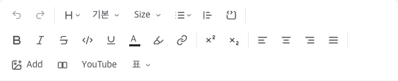
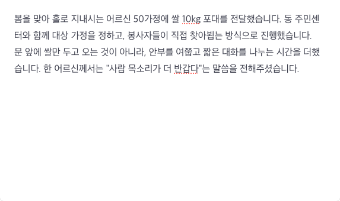
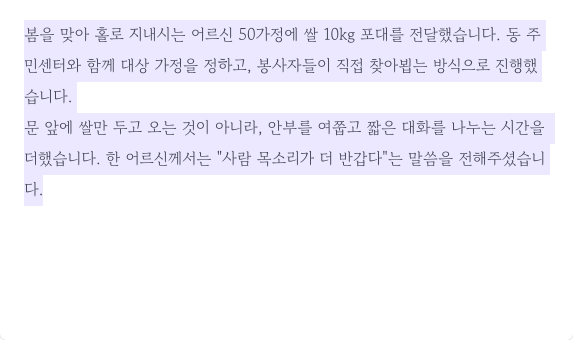

# 검증 리포트 — 게시물 글꼴 선택 (ADR-059)

- **일자**: 2026-08-28
- **브랜치**: `feat/editor-font-family`
- **환경**: 프로덕션 빌드 (`pnpm build` → `.next/standalone/server.js`, PORT 3100) · Postgres 로컬 5434 · 뷰포트 1280×900
- **도구**: Playwright MCP (실브라우저 조작 + DOM/`document.fonts` 계측) · `docker exec psql` (DB 원본 확인)

> dev 서버가 아니라 **프로덕션 빌드**로 검증했다. dev 는 StrictMode 이중 마운트 때문에
> Tiptap 툴바가 포커스 전까지 비활성인데(기존 동작), 이 상태로는 드롭다운 동작을 판정할 수 없다.

---

## 시나리오와 결과

### S1. 툴바에 글꼴 드롭다운이 나오는가

에디터 본문을 클릭해 포커스 → 툴바 확인.



**결과 PASS** — `H ⌄` 다음에 **`기본 ⌄`** (글꼴), 그 다음 `Size ⌄`. 커서 위치의 글꼴을 트리거 라벨로
보여주므로 운영자가 "지금 무슨 글꼴인지" 모르는 채 쓰지 않는다.

> 툴바는 **에디터를 한 번 클릭해 포커스를 준 뒤** 활성화된다. 기존 동작이며 이 PR 과 무관하다
> (`FontSizeDropdownMenu` 도 동일하게 포커스 전에는 렌더되지 않는다).

### S2. 6종이 각자의 글꼴로 미리보기되는가

글꼴 드롭다운 열기.


**결과 PASS** — 기본 / 본명조 / 나눔명조 / 고운바탕 / 나눔고딕 / 개구. 항목마다 **그 글꼴로 렌더**된다
(명조 3종은 세리프, 개구는 손글씨체로 육안 구분 가능). 이름만 나열하면 운영자가 고를 수 없다.

### S3. 선택이 에디터에 즉시 반영되는가

본문 전체 선택(`Cmd+A`) → 드롭다운에서 **고운바탕** 선택.

| 적용 전 (기본 SUIT) | 적용 후 (고운바탕) |
|---|---|
|  |  |

**결과 PASS** — 고딕(SUIT) → 세리프(고운바탕)로 전환. WYSIWYG 성립.

### S4. 저장값이 대표 패밀리명 하나인가

발행 후 DB 원본 조회.

```
$ docker exec ffwpu-postgres psql -U ffwpu -d ffwpu_social \
    -tAc "SELECT body::text FROM news WHERE id='42ea6951-…';" | (fontFamily 추출)

DB 저장된 fontFamily: 'Gowun Batang'
```

**결과 PASS** — 스택(`'Gowun Batang', serif`)이 아니라 **대표 패밀리명 하나**로 저장됐다.
폴백은 렌더 시점에 붙으므로, 나중에 폴백을 손봐도 발행된 글이 글꼴을 잃지 않는다.

### S5. 공개 페이지가 그 글꼴로 렌더되는가


```js
// Playwright browser_evaluate
{
  inlineStyle:      "font-family:'Gowun Batang', serif",
  computed:         '"Gowun Batang", serif',
  stylesheetInHead: "HEAD",
  stylesheetHref:   "https://fonts.googleapis.com/css2?family=Gowun+Batang:wght@400;700&display=swap"
}
```

**결과 PASS** — 인라인 스타일에 폴백 포함 스택이 적용되고, 스타일시트가 `<head>` 에 있다.

> 초기 HTML 에는 `preload` 만 실린다 — 본문이 PPR 스트리밍 경계 안이라 실제
> `<link rel="stylesheet">` 는 하이드레이션 때 React 가 `<head>` 로 끌어올린다. 위 계측이 그 결과다.
> JS 가 없으면 폴백 `serif` 로 읽힌다 (본문 가독성 영향 없음).

### S6. 쓴 글자의 청크만 받는가 — 이 PR 설계의 핵심

`document.fonts` 로 face 로딩 상태 집계.

| 글 | 글꼴 | 로드된 청크 | 전체 |
|---|---|---|---|
| 쌀 50포대 전달 | 고운바탕 | **13** | 190 |
| 한식 행사 쌀 화환 | 나눔명조 | **10** | 184 |

**결과 PASS** — 세 문단짜리 글이 전체 청크의 **5~7%** 만 로드했다. 구글의 unicode-range 분할이
살아 있다는 증거이며, 한글 웹폰트(고운바탕 전체 3.0MB)를 통째로 받지 않는다.

### S7. 글꼴을 안 쓴 글은 요청이 0건인가

글꼴 마크가 없는 다른 글(`동작구립 흑석종합사회복지관에 쌀 60kg 전달`)에서 계측.

```js
{
  title:               "동작구립 흑석종합사회복지관에 쌀 60kg 전달",
  styledSpans:          0,
  fontLinks:            0,   // ← <link> 자체가 안 그려짐
  fontNetworkRequests:  0    // ← googleapis/gstatic 요청 0건
}
```

**결과 PASS** — `googleFontsHref()` 가 `null` 을 반환해 `<link>` 를 아예 렌더하지 않는다.
글꼴 기능을 쓰지 않는 글에는 **비용이 0** 이다.

### S8. 화이트리스트 밖 글꼴이 막히는가 (단위 테스트)

`src/features/news/render/font-family.test.ts` — 15건.

| 검증 | 입력 → 기대 |
|---|---|
| 브라우저 직렬화형 파싱 | `'"Noto Serif KR", serif'` → `Noto Serif KR` |
| 대소문자 흡수 | `'nanum gothic'` → `Nanum Gothic` |
| docx 임의 글꼴 drop | `'맑은 고딕'`, `'Malgun Gothic, sans-serif'` → `null` (textStyle 마크 자체 소멸) |
| 요청 묶기 | `['Nanum Myeongjo','Gaegu']` → `family=` 2개, 1 요청 |
| 중복·미등록 제거 | `['Nanum Myeongjo','Nanum Myeongjo','맑은 고딕']` → `family=` 1개 |
| 링크 미생성 | `[]`, `['맑은 고딕']` → `null` |
| **목록 왕복 불변식** | 모든 항목에 `normalizeFontFamily(f.stack) === f.value` |

마지막 항목이 중요하다 — 나중에 스택을 고치면서 저장값과 어긋나면 발행된 글이 조용히 글꼴을 잃는데,
이 테스트가 컴파일 대신 그걸 잡는다.

---

## 라이선스·비용 확인 (요청받은 선행 확인 사항)

1차 출처인 `google/fonts` 저장소의 `METADATA.pb` 를 직접 조회:

```
$ curl -s ".../google/fonts/main/ofl/<slug>/METADATA.pb" | grep -m1 "license:"

nanummyeongjo    200  license: "OFL"
notoserifkr      200  license: "OFL"
gowunbatang      200  license: "OFL"
songmyung        200  license: "OFL"
nanumgothic      200  license: "OFL"
gaegu            200  license: "OFL"
```

SIL Open Font License 1.1 — 상업 이용·웹폰트 임베딩·재배포 모두 허용. **비용 0원.**
Tiptap `FontFamily` 도 이미 설치된 `@tiptap/extension-text-style` 에 포함돼 있어 **신규 의존성 0개**.

### 용량 실측 (400+700 두 웨이트, 전체 청크 합)

| 글꼴 | 청크 | 전체 | 청크당 |
|---|---|---|---|
| 나눔고딕 | 184 | 2.0 MB | 11 KB |
| 나눔명조 | 184 | 2.6 MB | 14 KB |
| 고운바탕 | 190 | 3.0 MB | 16 KB |
| 개구 | 178 | 1.1 MB | 6 KB |
| **본명조 (Noto Serif KR)** | 248 | **12.2 MB** | **49 KB** |

본명조가 나머지의 4~6배다(한자 포함 글리프셋). S6 처럼 쓴 청크만 받으므로 부담은 그 글 독자만
지지만, 실사용에서 체감되면 `EDITOR_FONTS` 에서 한 줄 빼면 된다 — 발행된 글은 폴백 serif 로 렌더된다.

---

## 자동 검증

```
pnpm tsc --noEmit   ✓
pnpm lint           ✓
pnpm vitest run     ✓  19 files / 167 tests
pnpm build          ✓
```

## 미해결

- 없음. 마이그레이션 없고 배포 후 별도 작업도 없다.
- **CSP 를 도입하면** `font-src https://fonts.gstatic.com` · `style-src https://fonts.googleapis.com`
  을 허용해야 한다. 현재 이 프로젝트엔 CSP 헤더가 없다.
