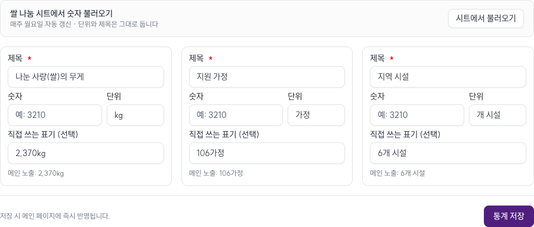
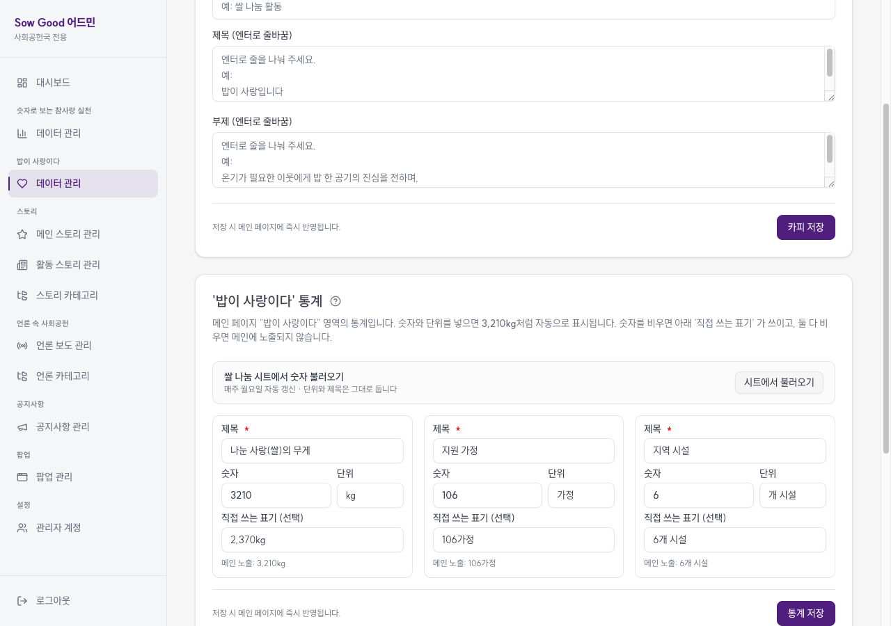
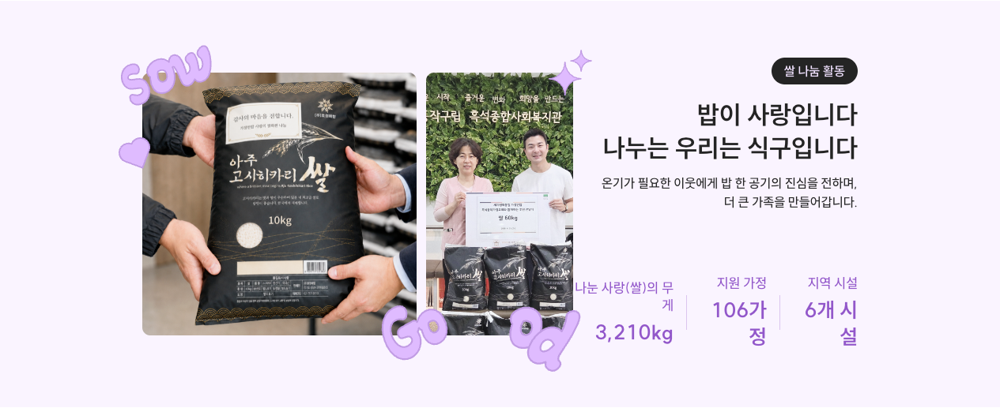

# 검증 리포트 — 쌀나눔 시트 → StorySection 통계 (ADR-058)

- **일자**: 2026-08-28
- **브랜치**: `feat/rice-sheet-sync`
- **환경**: 프로덕션 빌드 (`pnpm build` → `.next/standalone/server.js`, PORT 3100) · Postgres 로컬 5434 · 뷰포트 1280×900
- **도구**: Playwright MCP (실브라우저 조작·촬영) · `curl` (cron 엔드포인트) · `docker exec psql` (DB 원본)
- **시트**: `docs.google.com/spreadsheets/d/1rHTzNuqFA1d0BQFhmThIGEwJZsK5hFHPJttbhqzV1vw` (gid=0)

**동기화 전 상태를 DB 에서 실제로 재현**한 뒤 시작했다 — `value=NULL` + 운영자 수기 표기
(`2,370kg` / `106가정` / `6개 시설`). prod 의 현재 모습과 같은 상태다.

---

## S0. 시트가 인증 없이 읽히는가 (선행 확인)

```
$ curl -sL -w "\nHTTP:%{http_code}\n" \
    "https://docs.google.com/spreadsheets/d/<시트ID>/export?format=csv&gid=0"

순번,행사명,행사일,쌀화환 참여기관 수,쌀 나눔 포대 수,쌀 나눔 포대 무게(kg),나눔가정 수,나눔 단체 수,나눔 기관명,비고
,,,175,323,"3,210",106,6,,
1,천일국 14년 한식 파주원전 참배식,2026. 4. 6,16,32,300,22,2,흑석종합사회복지관 6포/삼태기마을 4포,
…
HTTP:200
```

**결과 PASS** — 행 0 이 라벨, 행 1 이 총계. 기존 KPI 시트와 달리 Apps Script 경유가 필요 없다.

총계 행이 실제 합계인지도 검산했다: 쌀 무게 `300+840+1020+210+840 = 3210` ✓ ·
가정 `22+84 = 106` ✓ · 단체 `2+4 = 6` ✓.

> 🔴 이 시트는 **'링크가 있는 모든 사용자'** 공유 상태이고 실명·수혜 기관명이 들어 있다(ADR-004).
> 사이트로 나가는 값은 숫자 3개뿐이라 노출 경로는 없지만 시트 공유 범위 자체는 별건이다 —
> `docs/TODO.md` escalation 참조.

## S1. 동기화 전 랜딩 (기준선)


**나눔 쌀 2,370kg** · 지원 가정 106가정 · 지역 시설 6개 시설 — 운영자 수기 입력값.

## S2. 마이그레이션 0020 적용 직후 화면이 안 바뀌는가

이 PR 의 안전 장치다. `formatKpiDisplay` 는 `value` 가 `NULL` 이면 기존 `displayValue` 를 그대로
반환하므로, 단위만 backfill 된 상태에서는 화면이 **한 글자도 안 바뀐다**.

```
$ pnpm drizzle-kit migrate     # 0020_story_stats_unit_backfill
[✓] migrations applied successfully!

            slug            | value | display_value |  unit
----------------------------+-------+---------------+---------
 story_supported_orgs       |       | 2,370kg       | kg
 story_supported_households |       | 106가정       | 가정
 story_local_facilities     |       | 6개 시설      | 개 시설
```

**결과 PASS** — S1 스크린샷과 동일하게 렌더된다. 단위만 들어갔고 표시값은 그대로다.

로컬 DB 는 옛 시드가 `unit='시설'` 을 갖고 있었는데 그 행은 **덮어쓰지 않았다** —
`WHERE unit IS NULL OR unit=''` 가드가 "운영자 입력 우선"으로 동작함을 확인한 셈이다.
(리포트 촬영을 위해 별도로 `개 시설` 로 맞춰 두었다.)

## S3. 어드민 폼 — 숫자·단위 칸과 불러오기 버튼



**결과 PASS** — 숫자는 빈칸, 단위는 마이그레이션이 넣은 값, `직접 쓰는 표기` 에 기존 수기 값,
그리고 `메인 노출: 2,370kg` 미리보기. 지금 화면에 뭐가 나가는지 폼에서 바로 보인다.

## S4. "시트에서 불러오기" — 숫자만 채우고 나머지는 건드리지 않는가



**결과 PASS** — 숫자 칸이 `3210` / `106` / `6` 으로 채워지고 **단위·제목은 그대로**,
미리보기가 `메인 노출: 3,210kg` 으로 즉시 바뀐다. DB 는 아직 안 건드린 상태라
운영자가 확인 후 `통계 저장` 을 누른다.

## S5. 저장 후 랜딩 반영



**결과 PASS** — **2,370kg → 3,210kg**. 나머지 두 항목은 시트 값과 이미 같아서 그대로다
(106가정 · 6개 시설). S1 과 같은 프레이밍으로 촬영해 비교 가능하다.

## S6. cron 엔드포인트 — 두 시트를 한 번에

```
$ curl -H "Authorization: Bearer $CRON_SECRET" localhost:3100/api/cron/sync-kpi
{
  "ok": true,
  "reports": [
    { "kind": "impact", "ok": true,
      "synced": ["volunteer_count","volunteer_period","event_count"], "missing": [] },
    { "kind": "story",  "ok": true,
      "synced": ["story_supported_orgs","story_supported_households","story_local_facilities"], "missing": [] }
  ]
}
HTTP: 200

$ curl localhost:3100/api/cron/sync-kpi        # 인증 없이
{"error":"Unauthorized"}
HTTP: 403
```

**결과 PASS** — 한 번의 호출로 두 시트가 각각 동기화되고 시트별 결과가 따로 보고된다.
Bearer 가드도 동작한다.

## S7. 실패 격리 — 한 시트가 죽어도 다른 시트가 도는가

이 PR 에서 의도적으로 설계한 부분이다. 쌀나눔 URL 만 존재하지 않는 시트로 바꿔 재기동:

```
$ RICE_SHEET_CSV_URL="…/DOES_NOT_EXIST/export?format=csv&gid=0" node server.js
$ curl -H "Authorization: Bearer $CRON_SECRET" localhost:3100/api/cron/sync-kpi
{
  "ok": true,
  "reports": [
    { "kind": "impact", "ok": true,  "synced": [3개], "missing": [] },
    { "kind": "story",  "ok": false, "synced": [],
      "missing": [3개], "error": "시트 fetch 실패: HTTP 404" }
  ]
}
HTTP: 200
```

**결과 PASS** — 협회 지표는 계속 갱신되고, 쌀나눔만 에러로 보고된다.
전체 HTTP 는 200 이라 **GHA 워크플로가 붉게 뜨지 않는다**(전부 실패해야 500).

그리고 실패 후에도 랜딩 값은 보존된다:

```
aria-label: "나눈 사랑(쌀)의 무게 3,210kg"
aria-label: "지원 가정 106가정"
aria-label: "지역 시설 6개 시설"
```

## S8. env 미설정 시 메시지가 원인을 말하는가

`RICE_SHEET_CSV_URL` 을 아예 빼고 기동:

```
  impact: ok=True   error=-
  story:  ok=False  error=RICE_SHEET_CSV_URL is not set (쌀 나눔 대장 시트). Check .env.local
  전체 ok: True
```

**결과 PASS** — 어느 변수가 비었는지 이름으로 말한다. 협회 지표는 영향 없다.

## S9. 파서 단위 테스트 — 실제 CSV 구조 기준 6건

`src/features/kpi/sync/parse.test.ts` (기존 12건 + 신규 6건)

| 검증 | 기대 |
|---|---|
| 총계 행에서 story 통계 3개 추출 | `story_supported_orgs` · `story_supported_households` · `story_local_facilities` |
| 그룹 숫자 콤마 제거 | `"3,210"` → `3210`, `externalId` = `쌀 나눔 포대 무게(kg)` |
| 나눔가정/단체 수 | `106` · `6` |
| 행사별 행을 총계로 오인 안 함 | 첫 행사의 `22` 가정이 아니라 총계 `106` |
| 미매핑 컬럼 무시 | `175`(쌀화환 참여기관) · `323`(포대 수) 미포함 |
| **시트 교차 오염 방지** | `kind` 미지정 시 impact 맵이라 story 라벨 0건 매칭 |

마지막 항목이 중요하다 — 두 시트가 같은 파서를 쓰는데 라벨 맵을 잘못 넘기면 엉뚱한 시트의
숫자가 반대편 섹션에 들어갈 수 있다. `kind` 기본값이 impact 라 그 사고를 테스트가 막는다.

---

## 자동 검증

```
pnpm tsc --noEmit   ✓
pnpm lint           ✓
pnpm vitest run     ✓  18 files / 158 tests
pnpm build          ✓
```

## 머지 후 배포 절차 (`docs/deploy-env-checklist.md` §6.1)

1. Vercel 에 `RICE_SHEET_CSV_URL` 입력 → **Redeploy**
2. 마이그레이션 `0020` 적용 (migrate 워크플로)
3. GHA `Sync KPI + 쌀나눔 from Sheets (weekly)` → **Run workflow 수동 1회**
   — 안 돌리면 다음 월요일까지 `2,370kg` 이 그대로 노출된다 (S2 가 보여준 폴백 동작)
4. 랜딩 세 통계 육안 확인. 단위가 어긋나면 `/admin/landing` 에서 **단위 칸만** 수정

## 미해결

- 🔴 시트 공유 범위(실명 노출) — 사회공헌국 결정 대기. `docs/TODO.md`
- 4번째 통계(`쌀화환 참여기관 수` 175) 반영 여부 — 사회공헌국 확인 후. `docs/TODO.md`
